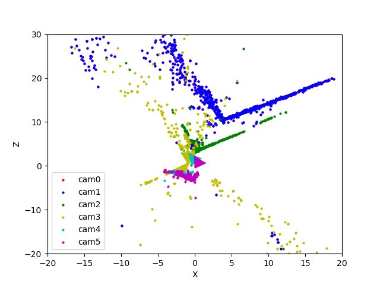

# SFM
This repository implements reconstruction of a 3D scene and simulataneously obtaining the camera poses of a monocular camera w.r.t the scene. 
The algorithm of the same is:

* Feature Matching and Outlier rejection using RANSAC

*  Estimating Fundamental Matrix
* Estimating Essential Matrix from Fundamental Matrix
* Estimate Camera Pose from Essential Matrix
* Check for Cheirality Condition using Triangulation
* Perspective-n-Point
 * Bundle Adjustment



## Run Instructions

```
python Wrapper.py --Path PATH_TO_DATA --Filtered False
```
